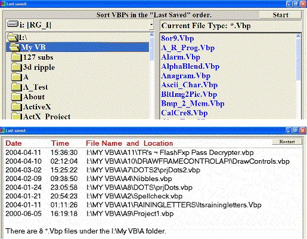



## Last VBP

### Description

I originally wrote this to scan my directories and sub-directories, then list the most recently saved VB Projects. I know that when I open VB, I can choose 'Recent' and pick from that list. However, when I download and try many programs from PSC, plus a few more of my own, that list quickly becomes quite cumbersome and it really doesn't tell me which ones I have edited. It also can list programs that have already been moved or deleted. So I wrote this.

Version 2.0.0 (May 30, 2007)

I changed the colors for a more standard Windows look.

I added this Help file and a whole NEW Menu system.

I replaced the TextBox with a RichTextBox.

The output list is saved to a text file which you may delete from the Popup Menu.

Note: The Fonts and colors may vary from the screenshot.
 
### More Info
 
You may change the File Type or use the default (*.Vbp).

A sorted list matching your criteria.

             |
---                |---
**Submitted On**   |2007-05-30 09:15:06
**By**             |[Randy Giese](https://github.com/Planet-Source-Code/PSCIndex/blob/master/ByAuthor/randy-giese.md)
**Level**          |Intermediate
**User Rating**    |4.5 (18 globes from 4 users)
**Compatibility**  |VB 6\.0
**Category**       |[Files/ File Controls/ Input/ Output](https://github.com/Planet-Source-Code/PSCIndex/blob/master/ByCategory/files-file-controls-input-output__1-3.md)
**World**          |[Visual Basic](https://github.com/Planet-Source-Code/PSCIndex/blob/master/ByWorld/visual-basic.md)
**Archive File**   |[Last\_VBP2068185302007\.Zip](https://github.com/Planet-Source-Code/randy-giese-last-vbp__1-62134/archive/master.zip)

